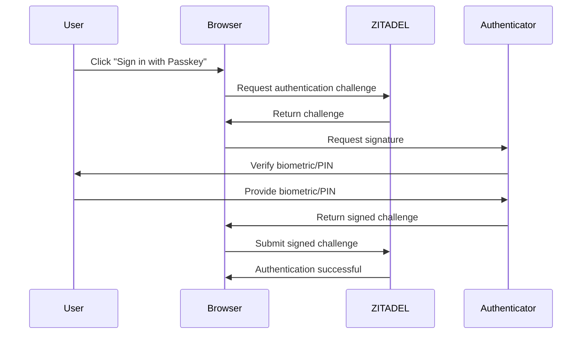

## Overview

ZITADEL provides comprehensive authentication capabilities supporting modern standards like OIDC, SAML, and Passkeys alongside traditional username/password flows. All authentication methods integrate seamlessly with ZITADEL's multi-tenancy model and can be customized per instance or organization.

## Authentication Methods

### Username and Password

Traditional credential-based authentication with enterprise-grade security:

- **Configurable password policies**: Minimum length, complexity requirements, expiration
- **Password hashing**: Industry-standard algorithms (bcrypt, argon2)
- **Lockout policies**: Automatic account lockout after failed attempts
- **Password import**: Migrate users from existing systems with hashed passwords

<Note>
When creating users via the API, you can provide `hashed_password` to migrate existing users without requiring password resets. ZITADEL supports multiple hashing algorithms for compatibility.
</Note>

### Passkeys (FIDO2 / WebAuthn)

Passwordless authentication using modern web standards:

- **Platform authenticators**: Face ID, Touch ID, Windows Hello
- **Security keys**: YubiKey, Titan Key, and other FIDO2 devices
- **Phishing-resistant**: Cryptographic authentication bound to your domain
- **User-friendly**: No passwords to remember or type



### Multi-Factor Authentication (MFA)

Add an extra layer of security beyond passwords:

<Tabs>
  <Tab title="OTP (Time-Based)">
    **Time-based One-Time Passwords**
    
    - Compatible with authenticator apps (Google Authenticator, Authy, 1Password)
    - Standard TOTP algorithm (RFC 6238)
    - QR code enrollment for easy setup
    - Backup codes for account recovery
  </Tab>
  
  <Tab title="OTP (Email)">
    **Email-based One-Time Passwords**
    
    - Verification codes sent to registered email
    - Configurable code expiration
    - Fallback when hardware tokens unavailable
    - Useful for account recovery flows
  </Tab>
  
  <Tab title="OTP (SMS)">
    **SMS-based One-Time Passwords**
    
    - Verification codes sent via SMS
    - Requires SMS provider integration
    - Convenient but less secure than other methods
    - Consider phishing and SIM-swap risks
  </Tab>
  
  <Tab title="U2F / FIDO2">
    **Universal 2nd Factor / FIDO2**
    
    - Hardware security keys
    - Phishing-resistant cryptographic verification
    - Can serve as both passwordless and 2nd factor
    - Most secure MFA option
  </Tab>
</Tabs>

<Warning>
MFA policies can be configured at the instance or organization level. Make sure to provide account recovery options for users who lose their MFA device.
</Warning>

### Social Logins

Allow users to sign in with existing accounts:

- **Pre-built templates**: Google, GitHub, Microsoft, Apple, and more
- **Generic OIDC**: Connect any OpenID Connect provider
- **Generic OAuth 2.0**: Support OAuth providers
- **SAML 2.0**: Enterprise identity providers
- **LDAP**: Active Directory and other directory services

#### Identity Brokering

ZITADEL acts as an identity broker, providing:

- **Unified identity**: Map external accounts to ZITADEL users
- **Just-in-time provisioning**: Auto-create users on first login
- **Account linking**: Connect multiple external identities to one user
- **Custom attribute mapping**: Transform claims from external providers

### Machine-to-Machine Authentication

Authenticate services and APIs without user interaction:

<AccordionGroup>
  <Accordion title="JWT Profile (Recommended)">
    Service accounts authenticate using signed JWTs:
    
    ```bash
    # Create a signed JWT assertion
    JWT=$(create-signed-jwt --key service-account-key.json)
    
    # Exchange for access token
    curl -X POST https://$ZITADEL_DOMAIN/oauth/v2/token \
      -H "Content-Type: application/x-www-form-urlencoded" \
      -d "grant_type=urn:ietf:params:oauth:grant-type:jwt-bearer" \
      -d "assertion=$JWT" \
      -d "scope=openid profile email"
    ```
    
    **Benefits**:
    - No shared secrets to manage
    - Short-lived tokens
    - Cryptographic verification
  </Accordion>
  
  <Accordion title="Personal Access Tokens (PAT)">
    Long-lived tokens for scripts and automation:
    
    ```bash
    # Use PAT directly in API calls
    curl https://$ZITADEL_DOMAIN/v2/users \
      -H "Authorization: Bearer $PERSONAL_ACCESS_TOKEN"
    ```
    
    **Use cases**:
    - CI/CD pipelines
    - Administrative scripts
    - Temporary access for debugging
    
    **Security**: Store PATs securely (secrets manager, environment variables)
  </Accordion>
  
  <Accordion title="Client Credentials">
    OAuth 2.0 Client Credentials flow:
    
    ```bash
    curl -X POST https://$ZITADEL_DOMAIN/oauth/v2/token \
      -u "$CLIENT_ID:$CLIENT_SECRET" \
      -d "grant_type=client_credentials" \
      -d "scope=openid"
    ```
    
    **Use cases**:
    - Service-to-service communication
    - Backend APIs
    - Microservices authentication
  </Accordion>
</AccordionGroup>

## Authentication Protocols

### OpenID Connect (OIDC)

ZITADEL is **OpenID Connect certified**:

- **Authorization Code Flow**: For web applications with backend
- **Authorization Code Flow + PKCE**: For single-page apps and mobile
- **Implicit Flow**: Legacy support (not recommended)
- **Hybrid Flow**: Mix of code and token flows
- **Device Authorization**: For devices with limited input (TVs, IoT)
- **Token Exchange**: Impersonation and delegation scenarios

<CodeGroup>
```javascript JavaScript / React
import { createAuth } from '@zitadel/client'

const auth = createAuth({
  issuer: 'https://yourinstance.zitadel.cloud',
  clientId: 'your-client-id',
  redirectUri: 'http://localhost:3000/callback',
  scope: 'openid profile email',
})

// Initiate login
await auth.authorize()

// Handle callback
const tokens = await auth.handleCallback()
```

```go Go
import (
    "github.com/zitadel/oidc/v3/pkg/client/rp"
    "github.com/zitadel/oidc/v3/pkg/oidc"
)

provider, err := rp.NewRelyingPartyOIDC(
    "https://yourinstance.zitadel.cloud",
    "your-client-id",
    "your-client-secret",
    "http://localhost:8080/callback",
    []string{oidc.ScopeOpenID, oidc.ScopeProfile},
)
```

```python Python
from zitadel import ZitadelClient

client = ZitadelClient(
    issuer='https://yourinstance.zitadel.cloud',
    client_id='your-client-id',
    client_secret='your-client-secret',
    redirect_uri='http://localhost:5000/callback'
)

# Get authorization URL
auth_url = client.get_authorization_url()

# Exchange code for tokens
tokens = client.exchange_code(code)
```
</CodeGroup>

### SAML 2.0

Enterprise SSO integration:

- **Service Provider (SP) role**: Your app trusts ZITADEL as Identity Provider
- **Identity Provider (IdP) role**: ZITADEL trusts enterprise IdPs
- **Metadata-based configuration**: Standard SAML metadata exchange
- **Attribute mapping**: Customize claim transformations

### Custom Sessions

For authentication flows beyond standard OIDC/SAML:

- **Session API**: Direct session management via REST/gRPC
- **Custom login UI**: Build completely custom authentication flows
- **Headless authentication**: Integrate with mobile SDKs or native apps

```bash Create Custom Session
curl -X POST https://$ZITADEL_DOMAIN/v2/sessions \
  -H "Authorization: Bearer $ACCESS_TOKEN" \
  -H "Content-Type: application/json" \
  -d '{
    "checks": {
      "user": {
        "loginName": "alice@example.com"
      },
      "password": {
        "password": "securePassword123"
      }
    }
  }'
```

## Hosted Login

### Login UI V2

ZITADEL provides a fully-featured, customizable login interface:

- **Responsive design**: Works on desktop, tablet, and mobile
- **Customizable branding**: Logo, colors, and background per organization
- **Multiple authentication methods**: All methods available in one UI
- **Localization**: Support for multiple languages
- **Accessibility**: WCAG 2.1 compliant

<Note>
The hosted login UI is built with Next.js and React. You can customize the appearance through the Console or API without modifying code.
</Note>

### Self-Hosted Login UI

For complete control, host your own login UI:

1. Clone the ZITADEL login UI repository
2. Customize styling, layout, and behavior
3. Deploy to your infrastructure
4. Configure ZITADEL to use your custom UI

## Authentication Policies

Configure authentication behavior at different levels:

### Instance-Level Policies

Apply to all organizations in an instance:

- **Password complexity**: Minimum length, required character types
- **Password expiration**: Force regular password changes
- **Lockout policy**: Lock account after N failed attempts
- **Session lifetime**: How long users stay logged in
- **MFA enforcement**: Require MFA for all users or specific roles

### Organization-Level Policies

Override instance defaults per organization:

- **Custom password requirements**: Stricter or more relaxed than instance
- **Allowed authentication methods**: Disable username/password, require passkeys
- **Identity provider preferences**: Show specific IdPs first

<Tabs>
  <Tab title="Via Console">
    1. Navigate to **Instance Settings** or **Organization Settings**
    2. Select **Policies**
    3. Choose **Login Policy** or **Password Policy**
    4. Configure requirements and click **Save**
  </Tab>
  
  <Tab title="Via API">
    ```bash
    curl -X PUT https://$ZITADEL_DOMAIN/v2/settings/login_policy \
      -H "Authorization: Bearer $ACCESS_TOKEN" \
      -H "Content-Type: application/json" \
      -d '{
        "allowUsernamePassword": true,
        "allowPasskey": true,
        "forceMfa": false,
        "passwordlessType": "PASSWORDLESS_TYPE_ALLOWED",
        "passwordCheckLifetime": "240h"
      }'
    ```
  </Tab>
</Tabs>

## Token Exchange and Impersonation

Advanced authentication scenarios:

### Token Exchange (RFC 8693)

Exchange one token for another:

- **Delegation**: Service A calls Service B on behalf of a user
- **Impersonation**: Admin acts as a user for support
- **Step-up authentication**: Exchange token after MFA for elevated access

```bash Token Exchange Example
curl -X POST https://$ZITADEL_DOMAIN/oauth/v2/token \
  -H "Content-Type: application/x-www-form-urlencoded" \
  -d "grant_type=urn:ietf:params:oauth:grant-type:token-exchange" \
  -d "subject_token=$USER_TOKEN" \
  -d "subject_token_type=urn:ietf:params:oauth:token-type:access_token" \
  -d "requested_token_type=urn:ietf:params:oauth:token-type:access_token"
```

## Best Practices

<AccordionGroup>
  <Accordion title="Choose the Right Authentication Method">
    - **Public web apps**: OIDC with Authorization Code + PKCE
    - **Web apps with backend**: OIDC with Authorization Code
    - **Mobile apps**: OIDC with Authorization Code + PKCE
    - **SPAs**: OIDC with Authorization Code + PKCE
    - **Enterprise SSO**: SAML 2.0 or OIDC
    - **APIs**: Machine-to-machine with JWT Profile or Client Credentials
  </Accordion>
  
  <Accordion title="Security Recommendations">
    - Always use HTTPS in production
    - Enable MFA for privileged accounts (admins)
    - Use short-lived access tokens (15-60 minutes)
    - Implement refresh token rotation
    - Monitor failed login attempts
    - Use PKCE for all public clients
  </Accordion>
  
  <Accordion title="User Experience">
    - Offer multiple authentication methods
    - Prioritize passkeys for best UX
    - Provide clear error messages
    - Support account recovery flows
    - Remember user preferences (last used method)
  </Accordion>
  
  <Accordion title="Testing">
    - Test all authentication flows in staging
    - Verify token expiration and refresh
    - Test MFA enrollment and verification
    - Validate error handling (wrong password, locked account)
    - Test across browsers and devices
  </Accordion>
</AccordionGroup>

## Next Steps

<CardGroup cols={2}>
  <Card title="Login UI Guide" icon="right-to-bracket" href="/authentication/login-ui">
    Configure and customize the hosted login interface
  </Card>
  <Card title="Passkeys Setup" icon="fingerprint" href="/authentication/passkeys">
    Enable passwordless authentication with FIDO2
  </Card>
  <Card title="MFA Configuration" icon="shield-halved" href="/authentication/mfa">
    Set up multi-factor authentication policies
  </Card>
  <Card title="Authorization" icon="shield-check" href="/concepts/authorization">
    Learn about ZITADEL's role-based access control
  </Card>
</CardGroup>