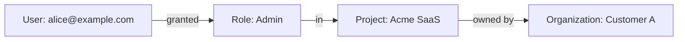

## Overview

ZITADEL implements **Role-Based Access Control (RBAC)** with fine-grained permissions that respect the multi-tenant hierarchy. Authorization is tightly integrated with the hierarchical model:

```
System → Instance → Organization → Project → Application
```

Permissions and roles are scoped to specific levels, ensuring users can only access resources they're authorized for.

## Core Authorization Concepts

### Roles

**Roles** are named collections of permissions defined at the project level.

- **Project-scoped**: Roles are created within a specific project
- **Custom definitions**: You define role names and their meanings
- **No built-in permissions**: ZITADEL doesn't dictate what roles mean — you implement the logic in your application
- **Included in tokens**: Roles are added to ID tokens and access tokens

<Note>
ZITADEL provides the **infrastructure for roles** but doesn't enforce authorization logic. Your application reads roles from tokens and implements the actual access control.
</Note>

### Role Grants

A **Role Grant** assigns a role to a user within a specific context:

- **User + Role + Context**: Who has which role, in what scope
- **Organization-scoped**: Grants are specific to an organization
- **Project-scoped**: Grants apply to a specific project



### Permissions

**Permissions** are fine-grained capabilities required to perform specific API operations.

- **Instance-level permissions**: For managing instance settings (e.g., `iam.web_key.write`)
- **Organization-level permissions**: For managing resources in an organization (e.g., `user.write`)
- **Checked by ZITADEL**: API endpoints automatically verify required permissions

<Accordion title="Permission Annotations in Proto Definitions">
API endpoints declare required permissions in protobuf:

```protobuf
rpc CreateWebKey(CreateWebKeyRequest) returns (CreateWebKeyResponse) {
  option (zitadel.protoc_gen_zitadel.v2.options) = {
    auth_option: {
      permission: "iam.web_key.write"
    }
  };
}
```

When a user calls this API:
1. ZITADEL checks if the user has the `iam.web_key.write` permission
2. If yes, the request proceeds
3. If no, returns `403 Forbidden`
</Accordion>

## How Authorization Works

### 1. Define Roles in Your Project

Create roles that make sense for your application:

<Tabs>
  <Tab title="Via Console">
    1. Navigate to your **Project**
    2. Click **Roles**
    3. Click **New Role**
    4. Enter role name (e.g., `admin`, `member`, `viewer`)
    5. Optionally add a display name and description
    6. Click **Save**
  </Tab>
  
  <Tab title="Via API">
    ```bash
    curl -X POST https://$ZITADEL_DOMAIN/v2/projects/$PROJECT_ID/roles \
      -H "Authorization: Bearer $ACCESS_TOKEN" \
      -H "Content-Type: application/json" \
      -d '{
        "key": "admin",
        "displayName": "Administrator",
        "description": "Full access to all features"
      }'
    ```
  </Tab>
</Tabs>

### 2. Grant Roles to Users

Assign roles to users within an organization:

<Tabs>
  <Tab title="Via Console">
    1. Navigate to **Organizations** → Select organization
    2. Click **Users** → Select user
    3. Click **Authorizations** tab
    4. Click **New**
    5. Select the project and role(s)
    6. Click **Save**
  </Tab>
  
  <Tab title="Via API">
    ```bash
    curl -X POST https://$ZITADEL_DOMAIN/v2/users/$USER_ID/grants \
      -H "Authorization: Bearer $ACCESS_TOKEN" \
      -H "Content-Type: application/json" \
      -d '{
        "projectId": "69629023906488334",
        "roleKeys": ["admin", "member"]
      }'
    ```
  </Tab>
</Tabs>

### 3. Roles Appear in Tokens

When a user authenticates, their roles are included in the tokens:

```json ID Token Example
{
  "iss": "https://yourinstance.zitadel.cloud",
  "sub": "163840776835432705",
  "aud": ["your-client-id"],
  "exp": 1709654321,
  "iat": 1709650721,
  "email": "alice@example.com",
  "email_verified": true,
  "name": "Alice Smith",
  
  // Roles for the project
  "urn:zitadel:iam:org:project:roles": {
    "admin": {
      "69629023906488334": "Acme SaaS"
    },
    "member": {
      "69629023906488334": "Acme SaaS"
    }
  }
}
```

<Note>
The `urn:zitadel:iam:org:project:roles` claim contains a nested structure:
- **Role key** → **Project ID** → **Project name**

This allows users to have different roles in different projects.
</Note>

### 4. Your Application Enforces Authorization

Your backend reads roles from tokens and implements access control:

<CodeGroup>
```javascript Node.js / Express
const express = require('express')
const jwt = require('jsonwebtoken')

function requireRole(requiredRole) {
  return (req, res, next) => {
    const token = req.headers.authorization?.split(' ')[1]
    const decoded = jwt.decode(token)
    
    const roles = Object.keys(
      decoded['urn:zitadel:iam:org:project:roles'] || {}
    )
    
    if (roles.includes(requiredRole)) {
      next()
    } else {
      res.status(403).json({ error: 'Insufficient permissions' })
    }
  }
}

// Protect route with role
app.delete('/api/users/:id', requireRole('admin'), (req, res) => {
  // Only users with 'admin' role can access this
})
```

```python Python / Flask
from flask import Flask, request, jsonify
from functools import wraps
import jwt

def require_role(role):
    def decorator(f):
        @wraps(f)
        def decorated_function(*args, **kwargs):
            token = request.headers.get('Authorization', '').split(' ')[1]
            decoded = jwt.decode(token, options={"verify_signature": False})
            
            roles = decoded.get('urn:zitadel:iam:org:project:roles', {}).keys()
            
            if role not in roles:
                return jsonify({'error': 'Insufficient permissions'}), 403
            
            return f(*args, **kwargs)
        return decorated_function
    return decorator

@app.route('/api/users/<id>', methods=['DELETE'])
@require_role('admin')
def delete_user(id):
    # Only users with 'admin' role can access this
    pass
```

```go Go
package main

import (
    "net/http"
    "github.com/golang-jwt/jwt/v5"
)

func RequireRole(role string, next http.HandlerFunc) http.HandlerFunc {
    return func(w http.ResponseWriter, r *http.Request) {
        tokenString := r.Header.Get("Authorization")[7:] // Remove "Bearer "
        token, _ := jwt.Parse(tokenString, nil)
        
        claims := token.Claims.(jwt.MapClaims)
        roles := claims["urn:zitadel:iam:org:project:roles"].(map[string]interface{})
        
        if _, ok := roles[role]; !ok {
            http.Error(w, "Insufficient permissions", http.StatusForbidden)
            return
        }
        
        next(w, r)
    }
}

func main() {
    http.HandleFunc("/api/users/", RequireRole("admin", deleteUser))
}
```
</CodeGroup>

## Administrative Roles

ZITADEL has built-in administrative roles for managing the platform itself:

### IAM Owners (Instance Admins)

**Scope**: Entire instance

**Capabilities**:
- Manage instance settings and policies
- Create and manage organizations
- View audit logs across all organizations
- Configure identity providers
- Manage instance branding

**Assignment**: Via ZITADEL Console or Admin API

### Organization Managers (Org Admins)

**Scope**: Specific organization

**Capabilities**:
- Manage users within the organization
- Create and manage projects
- Assign roles to users
- Configure organization branding
- View organization audit logs

**Assignment**: Via ZITADEL Console or Management API

### Project Owners

**Scope**: Specific project

**Capabilities**:
- Manage applications in the project
- Define and modify roles
- Grant project access to other organizations
- Configure project settings

**Assignment**: Via ZITADEL Console or Management API

<Warning>
Administrative roles are **separate from your application roles**. 

- **Administrative roles**: Manage ZITADEL itself
- **Project roles**: Manage access within your application

Don't confuse the two — they serve different purposes.
</Warning>

## Project Grants

**Project Grants** allow you to share a project with users from other organizations.

### Use Case: B2B Partner Access

Your SaaS company (Organization A) wants to give a partner company (Organization B) limited access to your application:

```
Organization A (You)
  └── Project: Acme SaaS
       ├── Roles: admin, member, viewer
       └── Applications: Web App, Mobile App

Organization B (Partner)
  └── Users: partner1@partnerco.com, partner2@partnerco.com
```

**Solution**: Grant the project to Organization B with limited roles:

<Tabs>
  <Tab title="Via Console">
    1. Navigate to your **Project**
    2. Click **Granted Organizations**
    3. Click **New**
    4. Select Organization B
    5. Select which roles to grant (e.g., only `viewer`)
    6. Click **Save**
    
    Now users in Organization B can be assigned the `viewer` role in your project.
  </Tab>
  
  <Tab title="Via API">
    ```bash
    curl -X POST https://$ZITADEL_DOMAIN/v2/projects/$PROJECT_ID/grants \
      -H "Authorization: Bearer $ACCESS_TOKEN" \
      -H "Content-Type: application/json" \
      -d '{
        "grantedOrgId": "69622366012355662",
        "roleKeys": ["viewer"]
      }'
    ```
  </Tab>
</Tabs>

<Note>
Project grants enable **delegated role management**: Organization B admins can assign the `viewer` role to their own users without involving Organization A.
</Note>

## Authorization with APIs

ZITADEL APIs have built-in authorization checks:

### Permission-Based Authorization

Some endpoints require specific permissions:

```protobuf
rpc CreateUser(CreateUserRequest) returns (CreateUserResponse) {
  option (zitadel.protoc_gen_zitadel.v2.options) = {
    auth_option: {
      permission: "user.write"
    }
  };
}
```

**Required**: User must have the `user.write` permission in the target organization.

### Authenticated-Only Endpoints

Other endpoints only require authentication:

```protobuf
rpc GetMyUser(GetMyUserRequest) returns (GetMyUserResponse) {
  option (zitadel.protoc_gen_zitadel.v2.options) = {
    auth_option: {
      permission: "authenticated"
    }
  };
}
```

**Required**: Valid access token (any authenticated user).

### Context-Based Authorization

Some endpoints check permissions based on the requested resource:

- **Reading own user**: No special permission required
- **Reading other users**: Requires `user.read` permission in the user's organization
- **Updating own user**: No special permission required
- **Updating other users**: Requires `user.write` permission

<Accordion title="Example: User Read Authorization">
```bash Read Own User (No Permission Needed)
curl https://$ZITADEL_DOMAIN/v2/users/me \
  -H "Authorization: Bearer $ACCESS_TOKEN"
```

```bash Read Other User (Requires user.read Permission)
curl https://$ZITADEL_DOMAIN/v2/users/163840776835432705 \
  -H "Authorization: Bearer $ACCESS_TOKEN"

# Returns 403 if you don't have user.read permission
# in the target user's organization
```
</Accordion>

## SCIM for Role Management

ZITADEL supports **SCIM 2.0** for automated user and role provisioning:

- **Provision users**: Create users from external identity systems
- **Assign roles**: Map groups to ZITADEL roles
- **Sync changes**: Keep user data and roles in sync

```json SCIM User with Roles
PATCH /scim/v2/Users/163840776835432705
{
  "schemas": ["urn:ietf:params:scim:api:messages:2.0:PatchOp"],
  "Operations": [
    {
      "op": "add",
      "path": "urn:ietf:params:scim:schemas:extension:zitadel:2.0:User:grants",
      "value": [
        {
          "projectId": "69629023906488334",
          "roles": ["admin", "member"]
        }
      ]
    }
  ]
}
```

## Actions for Custom Authorization

**Actions** allow you to customize authorization logic:

### Token Enrichment

Add custom claims to tokens based on your business logic:

```javascript Action: Add Department to Token
function enrichToken(ctx, api) {
  // Fetch user's department from your database
  const department = getUserDepartment(ctx.v1.user.id)
  
  // Add custom claim to token
  api.v1.claims.setClaim('department', department)
  
  // Add custom role based on business logic
  if (department === 'Engineering') {
    api.v1.claims.appendRoleToClaims('engineer')
  }
}
```

### Pre-Authorization Checks

Block authentication based on custom criteria:

```javascript Action: Require Email Verification
function preAuthentication(ctx, api) {
  if (!ctx.v1.user.emailVerified) {
    api.v1.setDenied('Email must be verified before login')
  }
}
```

## Best Practices

<AccordionGroup>
  <Accordion title="Role Naming">
    - Use lowercase names: `admin`, `member`, `viewer`
    - Be descriptive: `billing_admin` instead of `ba`
    - Consistent naming across projects
    - Document what each role means
  </Accordion>
  
  <Accordion title="Least Privilege Principle">
    - Grant minimum necessary roles
    - Use viewer/read-only roles by default
    - Require justification for admin roles
    - Regularly audit role assignments
  </Accordion>
  
  <Accordion title="Separation of Concerns">
    - **ZITADEL manages**: Authentication, role storage, token issuance
    - **Your app manages**: Role interpretation, feature access, data filtering
    
    Don't try to encode complex business logic in ZITADEL roles.
  </Accordion>
  
  <Accordion title="Testing Authorization">
    - Test with different role combinations
    - Verify token claims in your tests
    - Test API permission checks
    - Validate error responses (403 vs 404)
  </Accordion>
  
  <Accordion title="Performance">
    - Cache role checks in your application
    - Don't make API calls on every authorization check
    - Validate tokens locally using JWKS
    - Use short-lived tokens to ensure fresh role data
  </Accordion>
</AccordionGroup>

## Next Steps

<CardGroup cols={2}>
  <Card title="Roles Guide" icon="user-shield" href="/user-management/roles">
    Create and manage roles for your projects
  </Card>
  <Card title="Actions" icon="code" href="/integration/actions">
    Customize token claims and add business logic
  </Card>
  <Card title="SCIM Integration" icon="users-gear" href="/integration/scim">
    Automate user and role provisioning
  </Card>
  <Card title="API Authentication" icon="key" href="/api/authentication">
    Understand API permissions and authentication
  </Card>
</CardGroup>