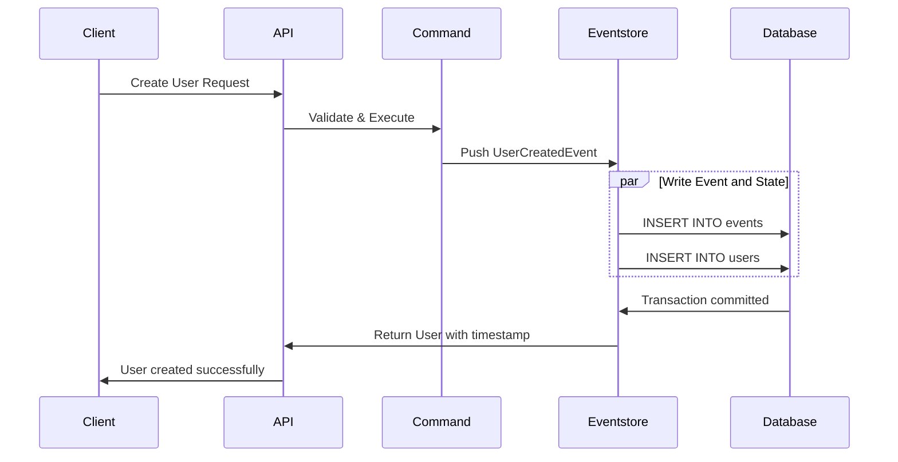
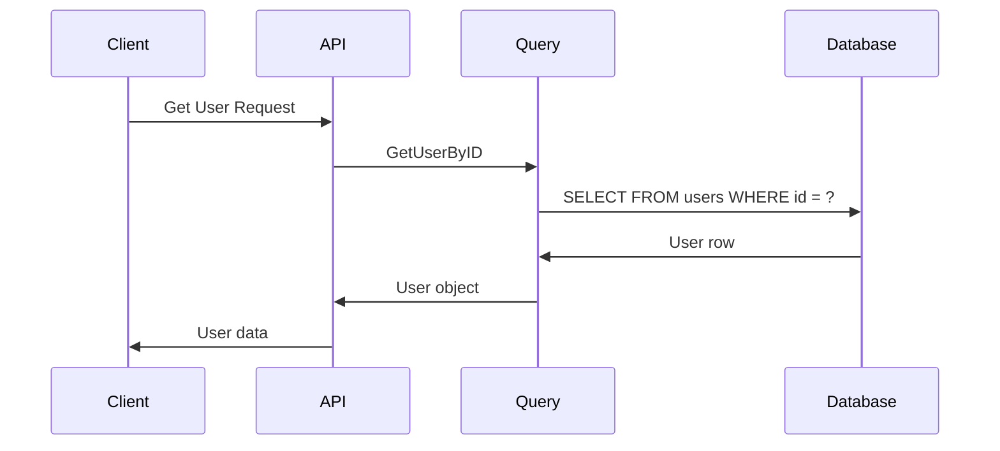

## Overview

ZITADEL implements a **hybrid data model** that combines relational databases with event sourcing. This architecture provides:

- **Fast queries**: Current state stored in relational tables
- **Complete audit trail**: Every mutation recorded as an immutable event
- **Temporal queries**: View system state at any point in time
- **Event streaming**: Export events to external systems for SIEM integration

<Note>
**Architecture Pattern**: Relational data is the **system of record** for current state. Events provide a complete history and audit trail, but are not the primary source of truth.
</Note>

## How It Works

### Write Path: Commands → Events → State

Every mutation in ZITADEL follows this pattern:



1. **Client makes request**: Create user, update organization, etc.
2. **Command layer validates**: Business rules, constraints, permissions
3. **Event is generated**: Immutable record of what changed
4. **Transaction writes both**:
   - Event to `events` table
   - Current state to relational table (e.g., `users`)
5. **Response includes**: Generated IDs and timestamps

<Accordion title="Code Example: Event Push">
```go
// From internal/eventstore/eventstore.go
func (es *Eventstore) Push(ctx context.Context, cmds ...Command) ([]Event, error) {
    return es.PushWithClient(ctx, nil, cmds...)
}

func (es *Eventstore) PushWithClient(
    ctx context.Context,
    client database.ContextQueryExecuter,
    cmds ...Command,
) ([]Event, error) {
    // Validate commands
    // Generate events
    // Write to database in transaction
    // Return persisted events
}
```

Events and state are written **atomically** in a single database transaction.
</Accordion>

### Read Path: Query Relational State

For current state, ZITADEL queries relational tables:



**Benefits**:
- Fast lookups by ID, email, username, etc.
- Efficient filtering and pagination
- Standard SQL indexes and query optimization
- No event replay needed for current state

### Audit Path: Query Event History

For audit trails and compliance, query the event log:

```bash List Events for a User
curl https://$ZITADEL_DOMAIN/v2/events \
  -H "Authorization: Bearer $ACCESS_TOKEN" \
  -H "Content-Type: application/json" \
  -d '{
    "aggregateType": "user",
    "aggregateId": "163840776835432705",
    "limit": 100
  }'
```

**Response**:
```json
{
  "events": [
    {
      "id": "event-1",
      "type": "user.created",
      "aggregateType": "user",
      "aggregateId": "163840776835432705",
      "timestamp": "2024-03-01T10:00:00Z",
      "data": {
        "username": "alice@example.com",
        "email": "alice@example.com"
      }
    },
    {
      "id": "event-2",
      "type": "user.email.verified",
      "aggregateType": "user",
      "aggregateId": "163840776835432705",
      "timestamp": "2024-03-01T10:05:00Z"
    },
    {
      "id": "event-3",
      "type": "user.profile.updated",
      "aggregateType": "user",
      "aggregateId": "163840776835432705",
      "timestamp": "2024-03-02T14:30:00Z",
      "data": {
        "firstName": "Alice",
        "lastName": "Smith-Jones"
      }
    }
  ]
}
```

## Event Structure

### Event Properties

Every event in ZITADEL contains:

| Property | Description | Example |
|----------|-------------|----------|
| **id** | Unique event identifier | `"163840776835432709"` |
| **type** | Event type (what happened) | `"user.created"` |
| **aggregateType** | Resource type | `"user"`, `"org"`, `"project"` |
| **aggregateId** | Resource identifier | `"163840776835432705"` |
| **sequence** | Sequential position in aggregate | `1`, `2`, `3`, ... |
| **timestamp** | When the event occurred | `"2024-03-01T10:00:00Z"` |
| **data** | Event payload (what changed) | JSON object with change details |
| **editor** | User/service that made the change | `"admin@example.com"` |
| **instanceId** | Instance where event occurred | For multi-tenancy isolation |

### Aggregate Types

Events are organized by **aggregate** — the entity that changed:

- **user**: User creation, updates, deletions
- **org**: Organization changes
- **project**: Project and application changes
- **instance**: Instance-level settings
- **iam**: System-level changes
- **session**: Authentication sessions
- **action**: Action (webhook/script) execution

<Accordion title="Event Type Registration">
From `internal/eventstore/eventstore.go`:

```go
// RegisterFilterEventMapper registers a function for mapping 
// an eventstore event to an event
func RegisterFilterEventMapper(
    aggregateType AggregateType,
    eventType EventType,
    mapper func(Event) (Event, error),
) {
    if mapper == nil || eventType == "" {
        return
    }
    
    appendEventType(eventType)
    appendAggregateType(aggregateType)
    
    if eventInterceptors == nil {
        eventInterceptors = make(map[EventType]eventTypeInterceptors)
    }
    
    interceptor := eventInterceptors[eventType]
    interceptor.eventMapper = mapper
    eventInterceptors[eventType] = interceptor
    eventTypeMapping[eventType] = aggregateType
}
```

This registration system ensures type safety and proper event handling.
</Accordion>

## Common Event Types

### User Events

- `user.created` — New user added
- `user.updated` — Profile information changed
- `user.deleted` — User removed
- `user.email.changed` — Email address updated
- `user.email.verified` — Email verification completed
- `user.phone.changed` — Phone number updated
- `user.password.changed` — Password updated
- `user.mfa.otp.added` — TOTP authenticator added
- `user.locked` — Account locked
- `user.unlocked` — Account unlocked

### Organization Events

- `org.created` — Organization created
- `org.updated` — Organization details changed
- `org.domain.added` — Custom domain added
- `org.domain.verified` — Domain ownership verified
- `org.member.added` — Member granted org access

### Project Events

- `project.created` — Project created
- `project.updated` — Project settings changed
- `project.role.added` — New role defined
- `project.application.added` — Application added to project
- `project.grant.added` — Project granted to another organization

### Authentication Events

- `session.created` — User logged in
- `session.updated` — Session refreshed
- `session.terminated` — User logged out
- `user.token.added` — Personal access token created

## Benefits of Event Sourcing

### 1. Complete Audit Trail

Every change is recorded with:
- **What changed**: Event type and data
- **When**: Precise timestamp
- **Who**: User or service that made the change
- **Where**: Instance and organization context

<Note>
Unlike systems that only log select activities, ZITADEL provides a **comprehensive event stream** of all mutations. Nothing is lost or overwritten.
</Note>

### 2. Compliance and Forensics

Event sourcing supports:

- **SOC 2 compliance**: Detailed audit logs for access reviews
- **GDPR**: Track all data changes and access
- **Forensic analysis**: Reconstruct exactly what happened during an incident
- **Regulatory reporting**: Export filtered event streams

### 3. Temporal Queries

View the system state at any point in time:

```bash What was the user's email on March 1st?
curl https://$ZITADEL_DOMAIN/v2/events \
  -d '{
    "aggregateType": "user",
    "aggregateId": "163840776835432705",
    "timestamp": "2024-03-01T23:59:59Z",
    "desc": false
  }'
```

Replay events up to the specified timestamp to reconstruct historical state.

### 4. Event Streaming to External Systems

Integrate with SIEM, data warehouses, and analytics:

- **Webhooks**: Real-time event delivery to your endpoints
- **Actions**: Execute custom code on specific events
- **Event log API**: Poll for new events
- **Database replication**: Stream events to external databases

<CodeGroup>
```javascript Webhook Handler
// Your webhook endpoint receives events
app.post('/webhooks/zitadel', (req, res) => {
  const event = req.body
  
  if (event.type === 'user.created') {
    // Send to analytics
    analytics.track({
      userId: event.aggregateId,
      event: 'User Signed Up',
      timestamp: event.timestamp
    })
  }
  
  res.status(200).send('OK')
})
```

```python SIEM Integration
import requests

def sync_zitadel_events_to_splunk():
    # Fetch recent events from ZITADEL
    events = get_zitadel_events(since=last_sync_time)
    
    # Forward to Splunk HEC
    for event in events:
        splunk_event = {
            'time': event['timestamp'],
            'event': event,
            'sourcetype': 'zitadel:audit'
        }
        requests.post(
            'https://splunk:8088/services/collector',
            headers={'Authorization': f'Splunk {HEC_TOKEN}'},
            json=splunk_event
        )
```
</CodeGroup>

## Event Guarantees

### Immutability

Events are **never modified or deleted**:
- Once written, events are permanent
- Corrections are new events (e.g., `user.email.changed` again)
- True append-only log

<Warning>
Event deletion is not supported. If you need to remove data for GDPR compliance, ZITADEL provides dedicated erasure APIs that mark resources as deleted without removing historical events.
</Warning>

### Ordering

Within an aggregate, events are strictly ordered:
- **Sequence numbers**: Monotonically increasing per aggregate
- **No gaps**: Sequence 1, 2, 3, ... with no missing values
- **Causal ordering**: Events reflect the actual order of operations

### Atomicity

Events and state changes are atomic:
- Written in a single database transaction
- Either both succeed or both fail
- No inconsistency between events and relational state

## Querying Events

### Filter by Aggregate

Get all events for a specific resource:

```json
{
  "aggregateType": "user",
  "aggregateId": "163840776835432705"
}
```

### Filter by Type

Get specific event types across all aggregates:

```json
{
  "eventTypes": ["user.created", "user.deleted"]
}
```

### Filter by Time Range

Get events within a specific period:

```json
{
  "timestamp": "2024-03-01T00:00:00Z",
  "untilTimestamp": "2024-03-31T23:59:59Z"
}
```

### Pagination

Handle large event streams:

```json
{
  "limit": 100,
  "offset": 0,
  "desc": false
}
```

## Performance Considerations

### Why Relational State Matters

Event sourcing **without** relational state requires:
- Replaying all events to get current state (slow for old aggregates)
- Complex event handlers and projections
- Eventually consistent read models

ZITADEL's hybrid approach provides:
- **Instant access** to current state (no replay needed)
- **Simple queries** using standard SQL
- **Strong consistency** (events and state written together)

### Event Table Growth

Events accumulate over time:
- Consider partitioning by time (PostgreSQL table partitions)
- Archive old events to cheaper storage
- Keep recent events in high-performance storage

<Note>
Event table growth is linear with activity, not users. A million users who never change generate no events after creation.
</Note>

## Best Practices

<AccordionGroup>
  <Accordion title="Use Events for Audit, State for Queries">
    - Query relational tables for current state (fast)
    - Query events for audit trails and compliance
    - Don't replay events to get current state
  </Accordion>
  
  <Accordion title="Monitor Event Growth">
    - Track event table size
    - Set up alerts for unusual event volume
    - Plan for archival of old events
  </Accordion>
  
  <Accordion title="Stream Events to External Systems">
    - Use webhooks for real-time integration
    - Poll event API for batch processing
    - Consider event ordering when processing
  </Accordion>
  
  <Accordion title="Retain Events for Compliance">
    - Define retention policy based on regulations
    - Archive (don't delete) old events
    - Encrypt event data at rest
  </Accordion>
  
  <Accordion title="Test Event Handling">
    - Verify events are created for all mutations
    - Test webhook delivery and retries
    - Validate event payload structure
  </Accordion>
</AccordionGroup>

## Next Steps

<CardGroup cols={2}>
  <Card title="Architecture" icon="diagram-project" href="/concepts/architecture">
    Learn about the overall system architecture
  </Card>
  <Card title="Actions & Webhooks" icon="webhook" href="/integration/actions">
    React to events with custom code and webhooks
  </Card>
  <Card title="Audit Log Integration" icon="file-contract" href="/integration/webhooks">
    Export events to SIEM and compliance systems
  </Card>
  <Card title="API Reference" icon="code" href="/api/overview">
    Explore the event query API
  </Card>
</CardGroup>