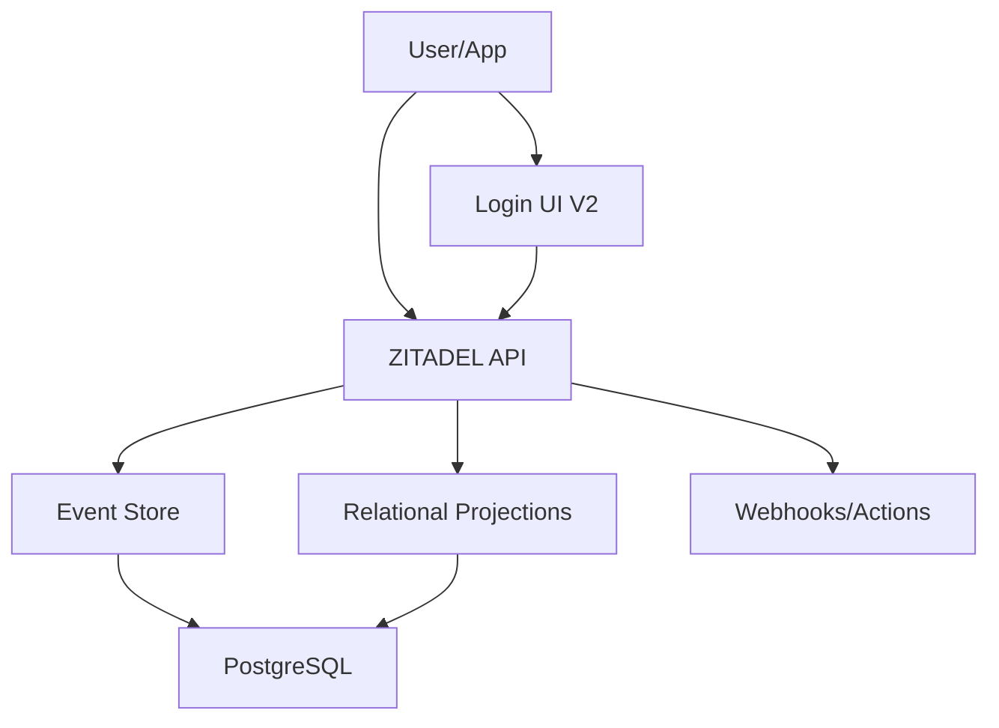

## The Identity Infrastructure for Developers

**ZITADEL** is an open-source identity and access management platform built for teams that need more than basic auth. Whether you're securing a SaaS product, building a B2B platform, or self-hosting a production IAM stack — ZITADEL gives you everything out of the box: SSO, MFA, Passkeys, OIDC, SAML, SCIM, and a battle-tested multi-tenancy model.

No vendor lock-in. No compromise on control. Just a robust, API-first identity platform you can own.

<Cards>
  <Card title="Quickstart" icon="rocket" href="/quickstart">
    Get ZITADEL running locally in under 3 minutes with Docker Compose
  </Card>
  <Card title="Core Concepts" icon="book" href="/concepts">
    Understand ZITADEL's architecture, multi-tenancy model, and event-driven design
  </Card>
  <Card title="API Reference" icon="code" href="/apis">
    Explore connectRPC, gRPC, and REST APIs for every resource
  </Card>
  <Card title="Examples & SDKs" icon="blocks" href="/examples">
    Ready-to-use examples for React, Next.js, Go, Python, and more
  </Card>
</Cards>

## Why ZITADEL?

We built ZITADEL to handle the hardest IAM challenges at scale — starting with multi-tenancy.

### Key Differentiators

<AccordionGroup>
  <Accordion title="Relational core, event-driven soul">
    Every mutation is written as an immutable event for a complete, API-accessible audit trail. Unlike systems that log only select activities, ZITADEL provides a comprehensive event stream that can be audited or streamed to external systems via Webhooks.
  </Accordion>
  
  <Accordion title="Strict multi-tenant hierarchy">
    Identity System → Organizations → Projects, with isolated data and policy scoping at multiple levels. Each instance is a fully isolated environment with its own users, policies, and configuration.
  </Accordion>
  
  <Accordion title="API-first design">
    Every resource and action is available via connectRPC, gRPC, and HTTP/JSON APIs. No feature is UI-only — everything is programmable.
  </Accordion>
  
  <Accordion title="Zero-downtime updates">
    Update ZITADEL without taking your identity system offline. New versions participate in leader election, update database schemas automatically, and signal readiness when ready to accept traffic.
  </Accordion>
  
  <Accordion title="Horizontal scalability">
    Scale linearly across multiple servers, data centers, or regions without external session stores. Distribute traffic by path, hostname, or any metadata.
  </Accordion>
</AccordionGroup>

## Core Features

### Authentication

- **Single Sign On (SSO)** — Unified login across all your applications
- **Passwordless** — [Passkeys (FIDO2 / WebAuthn)](/concepts/features/passkeys) for phishing-resistant authentication
- **Multi-Factor Authentication** — OTP, U2F, OTP Email, OTP SMS
- **Enterprise & Social IdPs** — [LDAP](/guides/integrate/identity-providers/ldap), SAML, OIDC providers
- **OpenID Connect certified** — Full OIDC compliance with [Device Authorization](/guides/integrate/login/oidc/device-authorization)
- **SAML 2.0** — Enterprise-grade federation
- **Machine-to-Machine** — JWT Profile, PAT, Client Credentials
- **Token Exchange** — [Impersonation and delegation](/guides/integrate/token-exchange)
- **Hosted Login V2** — Fully customizable authentication UI

### Multi-Tenancy & B2B

- **Infrastructure-level tenants** — Instances (high scale), Organizations, Projects
- **Identity Brokering** — Pre-built IdP templates for customer authentication
- **B2B Onboarding** — [Customizable self-service](/guides/integrate/onboarding/b2b) for your customers
- **Delegated Management** — Allow third parties to manage their own roles and users
- **Domain Discovery** — Route users to the right organization based on email domain

### Integration & APIs

- **Triple API Access** — [connectRPC, gRPC, and REST](/apis/introduction) for every resource
- **Actions & Webhooks** — Custom code execution, token enrichment, external integrations
- **RBAC** — Fine-grained role-based access control
- **SCIM 2.0 Server** — Automated user provisioning
- **Audit Log** — Complete event stream for SOC/SIEM integration
- **SDKs** — Official libraries for major languages and frameworks

### Administration

- **Self-Service Portal** — User registration with email/phone verification
- **Management Console** — Web-based admin UI for organizations and projects
- **Custom Branding** — Per-organization login page customization
- **Policy Engine** — Configurable password, login, and security policies

## Deployment Options

### ZITADEL Cloud (SaaS)

Start for free at [zitadel.com](https://zitadel.com) — no credit card required.

- **Regions**: US · EU · AU · CH
- **Pricing**: Pay-as-you-go
- **Managed**: Zero infrastructure management
- **Same Codebase**: Cloud and self-hosted run identical code

### ZITADEL Self-Hosted

Full control over your identity infrastructure.

<CardGroup cols={2}>
  <Card title="Docker Compose" icon="docker" href="/self-hosting/deploy/compose">
    Single-node deployment for development and homelab setups
  </Card>
  <Card title="Kubernetes" icon="kubernetes" href="/self-hosting/deploy/kubernetes">
    Production-ready Helm charts for high availability
  </Card>
</CardGroup>

**Database**: PostgreSQL 14+ (event store + relational model)

## Architecture Highlights

### How ZITADEL Works

1. **Dual Storage Model**: Events (audit trail) + relational projections (queries)
2. **No External Session Store**: Stateless design enables horizontal scaling
3. **Event Sourcing**: Every mutation creates an immutable event
4. **Multi-Tenancy**: Instance → Organization → Project hierarchy
5. **API Gateway**: gRPC-gateway exposes all APIs as REST/JSON

## Compliance & Standards

<Check>OpenID Connect Certified</Check>
<Check>FIDO2 / WebAuthn Support</Check>
<Check>SAML 2.0 Compatible</Check>
<Check>SCIM 2.0 Server</Check>
<Check>SOC 2 Compliance (Cloud)</Check>
<Check>GDPR Ready</Check>

## Community & Support

<CardGroup cols={2}>
  <Card title="Discord" icon="discord" href="https://zitadel.com/chat">
    Join our community for discussions and support
  </Card>
  <Card title="GitHub" icon="github" href="https://github.com/zitadel/zitadel">
    Contribute, report issues, and track development
  </Card>
  <Card title="Documentation" icon="book" href="https://zitadel.com/docs">
    Comprehensive guides and API references
  </Card>
  <Card title="Blog" icon="newspaper" href="https://zitadel.com/blog">
    Product updates, tutorials, and identity insights
  </Card>
</CardGroup>

## Next Steps

<Steps>
  <Step title="Get Started">
    Follow the [Quickstart Guide](/quickstart) to run ZITADEL locally in 3 minutes
  </Step>
  <Step title="Understand the Concepts">
    Read about [ZITADEL's architecture and multi-tenancy model](/concepts)
  </Step>
  <Step title="Integrate Your App">
    Explore [authentication examples](/examples) for your framework
  </Step>
  <Step title="Deploy to Production">
    Review [production deployment guides](/self-hosting/deploy) for Kubernetes or Docker Compose
  </Step>
</Steps>

## License

ZITADEL is licensed under [AGPL-3.0](https://github.com/zitadel/zitadel/blob/main/LICENSE) with Apache 2.0 and MIT exceptions for specific directories. See [LICENSING.md](https://github.com/zitadel/zitadel/blob/main/LICENSING.md) for the full licensing policy.
