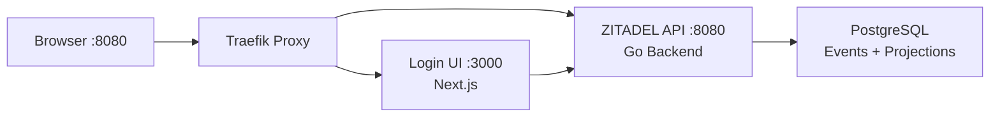

Get ZITADEL running on your local machine in under 3 minutes. This guide walks you through deploying ZITADEL with Docker Compose, creating your first application, and understanding the authentication flow.

## Prerequisites

Before you begin, make sure you have:

- **Docker** and **Docker Compose** installed ([Get Docker](https://docs.docker.com/get-docker/))
- **curl** or a web browser to interact with ZITADEL
- A terminal/command prompt

<Note>
This quickstart uses Docker Compose for local development. For production deployments, see [Kubernetes](/deployment/kubernetes) or [Docker Compose production guide](/deployment/docker-compose).
</Note>

## Step 1: Deploy ZITADEL Locally

ZITADEL provides a production-ready Docker Compose stack that includes everything you need: the API backend, Login UI, PostgreSQL database, and Traefik proxy.

<Steps>
  <Step title="Download the configuration files">
    Download the Docker Compose configuration and environment template:

    ```bash
    curl -LO https://raw.githubusercontent.com/zitadel/zitadel/main/deploy/compose/docker-compose.yml \
      && curl -LO https://raw.githubusercontent.com/zitadel/zitadel/main/deploy/compose/.env.example \
      && cp .env.example .env
    ```
  </Step>

  <Step title="Start the stack">
    Launch ZITADEL with Docker Compose:

    ```bash
    docker compose up -d --wait
    ```

    This command will:
    - Pull the ZITADEL API (`zitadel-api`), Login UI (`zitadel-login`), PostgreSQL, and Traefik images
    - Initialize the database with the first instance
    - Start all services and wait for health checks to pass

    <Note>
    First startup takes 1-2 minutes as ZITADEL initializes the database schema and creates the default instance.
    </Note>
  </Step>

  <Step title="Verify ZITADEL is running">
    Check that ZITADEL is accessible:

    ```bash
    curl -sS http://localhost:8080/.well-known/openid-configuration | jq '.issuer'
    ```

    You should see:
    ```json
    "http://localhost:8080"
    ```

    Open your browser and navigate to [http://localhost:8080](http://localhost:8080) to see the ZITADEL login page.
  </Step>
</Steps>

<Warning>
The default configuration uses **insecure credentials** for local development only. Before exposing ZITADEL to a network, change `ZITADEL_MASTERKEY`, `POSTGRES_ADMIN_PASSWORD`, and `POSTGRES_ZITADEL_PASSWORD` in your `.env` file.
</Warning>

## Step 2: Access the Management Console

The ZITADEL Management Console is your administrative hub for managing organizations, users, applications, and policies.

<Steps>
  <Step title="Get your initial admin credentials">
    During first startup, ZITADEL creates a default instance administrator. Check the logs to find the credentials:

    ```bash
    docker compose logs zitadel-api | grep -A 5 "Initial instance"
    ```

    Look for output like:
    ```
    Initial instance created:
    Username: zitadel-admin@zitadel.localhost
    Password: <generated-password>
    ```

    <Note>
    If you don't see credentials in the logs, they may have been created with a previous run. You can reset the admin password through the login UI or create a new admin user.
    </Note>
  </Step>

  <Step title="Log in to the Console">
    1. Navigate to [http://localhost:8080/ui/console](http://localhost:8080/ui/console)
    2. Enter the admin username and password from the logs
    3. You'll be prompted to change the password on first login

    <Tip>
    We recommend setting up a Passkey for passwordless authentication after your first login. Go to **User Settings** → **Passkeys** → **Add Passkey**.
    </Tip>
  </Step>
</Steps>

## Step 3: Create Your First Application

Now let's create an application that will use ZITADEL for authentication.

<Steps>
  <Step title="Create a new project">
    In the Management Console:
    1. Navigate to **Projects** in the sidebar
    2. Click **+ New Project**
    3. Enter a name (e.g., "My First App")
    4. Click **Create**

    <Info>
    Projects group related applications together. Multiple apps in the same project can share roles and role assignments.
    </Info>
  </Step>

  <Step title="Add an application">
    1. Inside your project, click **+ New Application**
    2. Enter an application name (e.g., "Web App")
    3. Select **User Agent** (for SPAs) or **Web** (for server-side apps)
    4. Click **Continue**
  </Step>

  <Step title="Configure redirect URIs">
    For a local development application:

    - **Redirect URI**: `http://localhost:3000/auth/callback`
    - **Post Logout Redirect URI**: `http://localhost:3000`

    <Note>
    These URIs must match exactly what your application sends during the OIDC flow. Adjust the port (3000) based on where your app runs.
    </Note>

    Click **Create** to finish.
  </Step>

  <Step title="Save your credentials">
    After creation, you'll see:
    - **Client ID** — Your application's unique identifier
    - **Client Secret** (for Web apps only) — Keep this secret!

    Copy these values — you'll need them to configure your application.

    <Warning>
    The client secret is shown only once. Store it securely (e.g., in a password manager or environment variable).
    </Warning>
  </Step>
</Steps>

## Step 4: Understand the Architecture

Here's what's running in your Docker Compose stack:



### Service Overview

<Accordion title="zitadel-api — Go Backend">
  The core ZITADEL API written in Go. Handles:
  - gRPC, connectRPC, and REST API endpoints
  - Event sourcing and relational projections
  - OIDC/SAML protocol flows
  - User management and authorization

  **Exposed via**: Traefik routes (not directly accessible)
</Accordion>

<Accordion title="zitadel-login — Next.js Login UI">
  The modern, customizable authentication UI (Login V2) built with Next.js.
  
  **URL**: `http://localhost:8080/ui/v2/login/`
</Accordion>

<Accordion title="postgres — PostgreSQL Database">
  Stores:
  - **Events table**: Immutable audit trail of every mutation
  - **Relational projections**: Optimized views for queries

  **Version**: PostgreSQL 17 (minimum supported: 14)
</Accordion>

<Accordion title="proxy — Traefik Reverse Proxy">
  Routes traffic to the correct service:
  - `/` → Login UI
  - `/ui/v2/login/` → Login UI
  - `/api/*` → ZITADEL API
  - Everything else (OIDC, gRPC, SAML) → ZITADEL API

  **Published port**: 8080 (HTTP)
</Accordion>

## Step 5: Test the OIDC Flow

Let's verify that OpenID Connect authentication works.

<CodeGroup>
```bash cURL - Discover Configuration
curl -sS http://localhost:8080/.well-known/openid-configuration | jq
```

```bash cURL - Test Authorization Endpoint
# Replace CLIENT_ID with your actual client ID
curl -v "http://localhost:8080/oauth/v2/authorize?client_id=CLIENT_ID&redirect_uri=http://localhost:3000/auth/callback&response_type=code&scope=openid%20profile%20email"
```
</CodeGroup>

You should be redirected to the ZITADEL login page.

### OIDC Flow Overview

<Steps>
  <Step title="User initiates login">
    Your app redirects to ZITADEL's authorization endpoint with a PKCE challenge
  </Step>
  <Step title="User authenticates">
    User logs in via the ZITADEL-hosted login page (username/password, Passkey, SSO, etc.)
  </Step>
  <Step title="Authorization code exchange">
    ZITADEL redirects back to your app with an authorization code
  </Step>
  <Step title="Token exchange">
    Your app exchanges the code for access and ID tokens
  </Step>
  <Step title="Access protected resources">
    Use the access token to call ZITADEL APIs or your own backend
  </Step>
</Steps>

## Step 6: Explore the API

ZITADEL exposes every capability over a typed API. Here's how to create a user with the V2 REST API:

<Steps>
  <Step title="Create a service account for API access">
    In the Management Console:
    1. Go to **Users** → **Service Accounts**
    2. Click **+ New Service Account**
    3. Enter a name (e.g., "API Client")
    4. Click **Create**
    5. Grant **IAM_OWNER** role (for testing only — use least privilege in production)
  </Step>

  <Step title="Generate a Personal Access Token (PAT)">
    1. Open the service account details
    2. Go to **Personal Access Tokens**
    3. Click **+ New**
    4. Set an expiration date
    5. Click **Create** and copy the token
  </Step>

  <Step title="Create a user via API">
    ```bash
    curl -X POST http://localhost:8080/v2/users/human \
      -H "Authorization: Bearer YOUR_PAT_TOKEN" \
      -H "Content-Type: application/json" \
      -d '{
        "username": "alice@example.com",
        "profile": {
          "givenName": "Alice",
          "familyName": "Smith"
        },
        "email": {
          "email": "alice@example.com",
          "isVerified": true
        },
        "password": {
          "password": "SecurePassword123!",
          "changeRequired": false
        }
      }'
    ```

    <Tip>
    Explore the full [API reference](/api/overview)
    </Tip>
  </Step>
</Steps>

## Next Steps

You've successfully deployed ZITADEL and created your first application! Here's what to explore next:

<CardGroup cols={2}>
  <Card title="Integrate with Your Framework" icon="code" href="/examples/nextjs">
    Ready-to-use examples for React, Next.js, Go, Python, and more
  </Card>
  <Card title="Understand Multi-Tenancy" icon="building" href="/concepts/multi-tenancy">
    Learn about Instances, Organizations, and Projects
  </Card>
  <Card title="Enable Passkeys" icon="key" href="/authentication/passkeys">
    Add passwordless authentication to your login flow
  </Card>
  <Card title="Production Deployment" icon="server" href="/deployment/kubernetes">
    Deploy ZITADEL to Kubernetes for high availability
  </Card>
  <Card title="OIDC Integration" icon="palette" href="/integration/oidc">
    Learn how to integrate with OpenID Connect
  </Card>
  <Card title="API Reference" icon="book" href="/api/overview">
    Explore connectRPC, gRPC, and REST APIs
  </Card>
</CardGroup>

## Troubleshooting

<AccordionGroup>
  <Accordion title="Port 8080 already in use">
    If port 8080 is already taken, edit `.env` and change `PROXY_HTTP_PUBLISHED_PORT` to another port (e.g., `8888`). Then restart:

    ```bash
    docker compose down
    docker compose up -d --wait
    ```

    Access ZITADEL at `http://localhost:8888` instead.
  </Accordion>

  <Accordion title="Instance not found error">
    This happens when `ZITADEL_EXTERNALDOMAIN` and `ZITADEL_EXTERNALPORT` don't match your actual URL.

    For local development with default settings:
    - `ZITADEL_EXTERNALDOMAIN=localhost`
    - `ZITADEL_EXTERNALPORT=8080`

    If you changed the port, update `ZITADEL_EXTERNALPORT` in `.env` and restart.
  </Accordion>

  <Accordion title="Services won't start">
    Check service logs:

    ```bash
    docker compose logs zitadel-api
    docker compose logs postgres
    ```

    Common issues:
    - PostgreSQL data corruption: `docker compose down -v` (destroys data!)
    - Insufficient Docker resources: Increase memory/CPU in Docker settings
  </Accordion>

  <Accordion title="Can't log in to the console">
    Reset the admin password by creating a new admin user:

    1. Check existing users: `docker compose logs zitadel-api | grep "Initial instance"`
    2. Or recreate the instance: `docker compose down -v && docker compose up -d --wait` (destroys all data!)
  </Accordion>
</AccordionGroup>

## Clean Up

To stop and remove the ZITADEL stack:

```bash
# Stop services but keep data
docker compose down

# Stop services and remove all data (cannot be undone!)
docker compose down -v
```

## Get Help

<CardGroup cols={3}>
  <Card title="Discord Community" icon="discord" href="https://zitadel.com/chat">
    Ask questions and get help from the community
  </Card>
  <Card title="GitHub Issues" icon="github" href="https://github.com/zitadel/zitadel/issues">
    Report bugs or request features
  </Card>
  <Card title="Documentation" icon="book" href="https://zitadel.com/docs">
    Explore comprehensive guides and references
  </Card>
</CardGroup>
