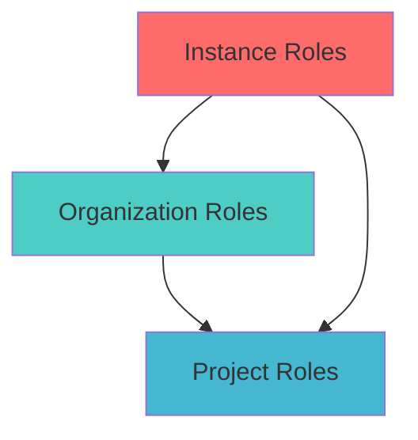

Roles are the foundation of authorization in ZITADEL. They define what users can do within your applications and how administrative access is controlled across organizations and instances.

## Understanding the Role Hierarchy

ZITADEL has three levels of roles, each serving a different purpose:



### Instance Roles

Control access to the entire ZITADEL instance. Only relevant for self-hosted deployments where you manage the instance.

- `IAM_OWNER`: Full instance administration
- Manage all organizations
- Configure instance-wide policies

### Organization Roles

Control administrative access within a specific organization.

<CardGroup cols={2}>
  <Card title="ORG_OWNER" icon="crown">
    Complete control over the organization, its users, projects, and settings. Can manage all aspects of the organization.
  </Card>
  <Card title="ORG_USER_MANAGER" icon="users">
    Can create, modify, and delete users within the organization. Cannot manage projects or organization settings.
  </Card>
  <Card title="ORG_PROJECT_PERMISSION_MANAGER" icon="shield-halved">
    Can manage project grants and user grants (role assignments). Controls who has access to which projects.
  </Card>
  <Card title="ORG_AUDITOR" icon="magnifying-glass">
    Read-only access to view organization data, users, projects, and audit logs. Cannot make changes.
  </Card>
</CardGroup>

### Project Roles

Custom roles you define to control access to your applications. These are the roles your application uses for authorization.

**Examples:**
- `admin` - Full access to the application
- `editor` - Can create and modify content
- `viewer` - Read-only access
- `reports:read` - Can view reports
- `users:write` - Can manage users

## How Role Assignment Works

Roles are assigned to users through **user grants**.

### The Relationship Model

```
User + Organization + Project + Roles = User Grant
```

A user grant connects:
- **Who**: A specific user
- **Where**: In which organization context
- **What**: Which project they can access
- **How**: With which project roles

### Example

Alice works for Acme Corp (Organization A) and needs access to the Customer Portal (Project 1):

```javascript
await userGrantService.addUserGrant({
  userId: "alice-user-id",
  organizationId: "acme-org-id",
  projectId: "customer-portal-project-id",
  roleKeys: ["admin", "reports:read"]
});
```

Now Alice has the `admin` and `reports:read` roles when accessing the Customer Portal.

## Project Roles in Detail

### Defining Roles

When you create a project, you define custom roles specific to that project:

```javascript
// Add roles to your project
await projectService.addProjectRole({
  projectId: "customer-portal-project-id",
  roleKey: "admin",
  displayName: "Administrator",
  group: "Management"
});

await projectService.addProjectRole({
  projectId: "customer-portal-project-id",
  roleKey: "editor",
  displayName: "Content Editor",
  group: "Content"
});

await projectService.addProjectRole({
  projectId: "customer-portal-project-id",
  roleKey: "viewer",
  displayName: "Viewer",
  group: "General"
});
```

### Role Naming Conventions

<AccordionGroup>
  <Accordion title="Simple Naming">
    Use simple, descriptive names:
    - `admin`
    - `editor`
    - `viewer`
    - `manager`

    **Best for:** Simple applications with few roles
  </Accordion>

  <Accordion title="Resource-Based Naming">
    Use `resource:action` format:
    - `users:read`
    - `users:write`
    - `reports:read`
    - `invoices:admin`

    **Best for:** Applications with many resources and granular permissions
  </Accordion>

  <Accordion title="Hierarchical Naming">
    Use dot notation for hierarchies:
    - `sales.manager`
    - `sales.rep`
    - `support.tier1`
    - `support.tier2`

    **Best for:** Applications with organizational structures
  </Accordion>
</AccordionGroup>

### Role Groups

The `group` field helps organize roles in the UI:

```javascript
roleKey: "users:write",
displayName: "User Manager",
group: "User Management"
```

This groups all user management-related roles together in the admin interface, making it easier to assign roles.

## Accessing Roles in Your Application

When a user authenticates, their roles are available in several places.

### In Tokens

If you enable `projectRoleAssertion` on the project, roles appear in tokens:

**ID Token:**
```json
{
  "iss": "https://your-domain.zitadel.cloud",
  "sub": "163840776835432705",
  "urn:zitadel:iam:org:project:69629026806489455:roles": {
    "admin": {
      "69629023906488334": "Acme Corporation"
    },
    "reports:read": {
      "69629023906488334": "Acme Corporation"
    }
  }
}
```

**Access Token:**
```json
{
  "urn:zitadel:iam:org:project:69629026806489455:roles": {
    "admin": {
      "69629023906488334": "Acme Corporation"
    }
  }
}
```

### Via Userinfo Endpoint

```javascript
const response = await fetch('https://your-domain.zitadel.cloud/oidc/v1/userinfo', {
  headers: {
    'Authorization': `Bearer ${accessToken}`
  }
});

const userInfo = await response.json();
const roles = userInfo['urn:zitadel:iam:org:project:YOUR_PROJECT_ID:roles'];
```

### Via Introspection

```bash
curl -X POST https://your-domain.zitadel.cloud/oauth/v2/introspect \
  -u "client_id:client_secret" \
  -d "token=access_token"
```

## Implementing Authorization

### In Your Application

Once you have the user's roles from the token, implement authorization logic:

```javascript
// Extract roles from token
function getUserRoles(token) {
  const rolesClaim = token[`urn:zitadel:iam:org:project:${PROJECT_ID}:roles`];
  return Object.keys(rolesClaim || {});
}

// Check if user has a role
function hasRole(token, role) {
  const roles = getUserRoles(token);
  return roles.includes(role);
}

// Check if user has any of the specified roles
function hasAnyRole(token, requiredRoles) {
  const userRoles = getUserRoles(token);
  return requiredRoles.some(role => userRoles.includes(role));
}

// Example usage in an API endpoint
app.get('/api/admin/users', (req, res) => {
  if (!hasRole(req.user, 'admin')) {
    return res.status(403).json({ error: 'Forbidden' });
  }
  
  // Admin logic here
});
```

### Middleware Example (Express.js)

```javascript
function requireRole(role) {
  return (req, res, next) => {
    if (!hasRole(req.user, role)) {
      return res.status(403).json({ 
        error: 'Forbidden',
        message: `This action requires the '${role}' role`
      });
    }
    next();
  };
}

function requireAnyRole(...roles) {
  return (req, res, next) => {
    if (!hasAnyRole(req.user, roles)) {
      return res.status(403).json({ 
        error: 'Forbidden',
        message: `This action requires one of: ${roles.join(', ')}`
      });
    }
    next();
  };
}

// Usage
app.delete('/api/users/:id', 
  requireRole('admin'),
  deleteUserHandler
);

app.get('/api/reports',
  requireAnyRole('admin', 'reports:read'),
  getReportsHandler
);
```

## Multi-Organization Role Assignments

A user can have different roles in the same project depending on which organization they're acting in.

### Example Scenario

Bob is a consultant who works with multiple clients:

```javascript
// Bob has admin role in Acme Corp
await addUserGrant({
  userId: "bob-id",
  organizationId: "acme-org-id",
  projectId: "customer-portal-id",
  roleKeys: ["admin"]
});

// Bob has viewer role in Beta Inc
await addUserGrant({
  userId: "bob-id",
  organizationId: "beta-org-id",
  projectId: "customer-portal-id",
  roleKeys: ["viewer"]
});
```

When Bob logs in:
- Via `bob@acme.com` → He has the `admin` role
- Via `bob@beta.com` → He has the `viewer` role

The roles in the token show both:

```json
{
  "urn:zitadel:iam:org:project:customer-portal-id:roles": {
    "admin": {
      "acme-org-id": "Acme Corporation"
    },
    "viewer": {
      "beta-org-id": "Beta Inc"
    }
  }
}
```

## Authorization Checks in ZITADEL

ZITADEL can enforce authorization at the authentication level.

### Authorization Required

Enable this on the project to ensure users have at least one role:

```javascript
await projectService.updateProject({
  projectId: "customer-portal-id",
  authorizationRequired: true
});
```

Now:
- Users **with** role assignments can log in ✓
- Users **without** role assignments are denied ✗

### Project Access Required

Ensure the user's organization has access to the project:

```javascript
await projectService.updateProject({
  projectId: "customer-portal-id",
  projectAccessRequired: true
});
```

Now:
- Users from the **owner organization** can log in ✓
- Users from **granted organizations** can log in ✓
- Users from **other organizations** are denied ✗

## Managing User Grants

### Assigning Roles

```javascript
// Via Management API
await managementService.addUserGrant({
  userId: "user-id",
  projectId: "project-id",
  projectGrantId: "grant-id", // Optional, for granted projects
  roleKeys: ["editor", "viewer"]
});
```

### Updating Role Assignments

```javascript
await managementService.updateUserGrant({
  userId: "user-id",
  grantId: "grant-id",
  roleKeys: ["admin"] // Replaces previous roles
});
```

### Removing Role Assignments

```javascript
await managementService.removeUserGrant({
  userId: "user-id",
  grantId: "grant-id"
});
```

### Listing User Grants

See all of a user's role assignments:

```javascript
const grants = await managementService.listUserGrants({
  filters: [
    {
      userIdFilter: {
        userId: "user-id"
      }
    }
  ]
});
```

## Project Grants and Roles

When granting a project to another organization, you specify which roles they can assign:

```javascript
await projectService.createProjectGrant({
  projectId: "customer-portal-id",
  grantedOrganizationId: "partner-org-id",
  roleKeys: ["viewer", "editor"] // Only these roles available
});
```

Now the partner organization can:
- Assign `viewer` and `editor` roles to their users ✓
- **Cannot** assign `admin` role ✗

This enables secure multi-tenant role delegation.

## Best Practices

<AccordionGroup>
  <Accordion title="Role Design Principles">
    - **Principle of Least Privilege**: Grant only the permissions users need
    - **Role Granularity**: More specific roles are better than catch-all roles
    - **Avoid Role Explosion**: Don't create too many similar roles
    - **Document Roles**: Clearly define what each role can do
    - **Review Regularly**: Audit role assignments quarterly
  </Accordion>

  <Accordion title="Naming and Organization">
    - Use consistent naming across all projects
    - Group related roles using the `group` field
    - Use descriptive display names for the UI
    - Keep role keys short and URL-safe
    - Document role hierarchies if you use them
  </Accordion>

  <Accordion title="Authorization Implementation">
    - Always verify roles server-side, never trust client-side checks
    - Cache role checks to improve performance
    - Use middleware for common authorization patterns
    - Log authorization failures for security monitoring
    - Implement graceful degradation (show/hide features based on roles)
  </Accordion>

  <Accordion title="Multi-Tenant Considerations">
    - Consider organization context when checking roles
    - Use project grants to control cross-organization access
    - Enable `projectAccessRequired` for SaaS applications
    - Test authorization with users from different organizations
    - Document which roles are available via project grants
  </Accordion>

  <Accordion title="Security">
    - Enable `authorizationRequired` to prevent unauthorized access
    - Limit `ORG_OWNER` role assignments
    - Regularly audit role assignments and remove unused grants
    - Use separate roles for admin vs user functionality
    - Consider time-limited role assignments for temporary access
  </Accordion>
</AccordionGroup>

## Common Authorization Patterns

### Role-Based Access Control (RBAC)

The most common pattern - assign roles, check roles:

```javascript
if (hasRole(user, 'admin')) {
  // Admin functionality
}
```

### Hierarchical Roles

Higher roles inherit lower role permissions:

```javascript
const roleHierarchy = {
  'admin': ['editor', 'viewer'],
  'editor': ['viewer'],
  'viewer': []
};

function hasPermission(userRole, requiredRole) {
  if (userRole === requiredRole) return true;
  return roleHierarchy[userRole]?.includes(requiredRole) || false;
}
```

### Resource-Based Roles

Roles tied to specific actions on resources:

```javascript
function canAccessResource(user, resource, action) {
  const requiredRole = `${resource}:${action}`;
  return hasRole(user, requiredRole);
}

if (canAccessResource(user, 'reports', 'read')) {
  // Show reports
}
```

### Organization-Scoped Authorization

Check roles in the context of a specific organization:

```javascript
function hasRoleInOrg(token, role, orgId) {
  const rolesClaim = token[`urn:zitadel:iam:org:project:${PROJECT_ID}:roles`];
  return rolesClaim?.[role]?.[orgId] !== undefined;
}
```

## Troubleshooting

<AccordionGroup>
  <Accordion title="Roles not appearing in tokens">
    **Cause**: `projectRoleAssertion` is not enabled

    **Solution**:
    ```javascript
    await projectService.updateProject({
      projectId: "your-project-id",
      projectRoleAssertion: true
    });
    ```
  </Accordion>

  <Accordion title="User can't log in despite having a user account">
    **Cause**: `authorizationRequired` is enabled but user has no role assignments

    **Solution**: Assign at least one project role to the user
    ```javascript
    await addUserGrant({
      userId: "user-id",
      projectId: "project-id",
      roleKeys: ["viewer"]
    });
    ```
  </Accordion>

  <Accordion title="User from granted organization can't log in">
    **Cause**: Role was removed from project grant

    **Solution**: Update the project grant to include the necessary roles
    ```javascript
    await projectService.updateProjectGrant({
      projectId: "project-id",
      grantedOrganizationId: "org-id",
      roleKeys: ["viewer", "editor"] // Include all needed roles
    });
    ```
  </Accordion>

  <Accordion title="Wrong roles after switching organizations">
    **Cause**: User has different role assignments in different organizations

    **Solution**: This is expected behavior. Check the organization context in your authorization logic.
  </Accordion>
</AccordionGroup>

## Related Concepts

<CardGroup cols={3}>
  <Card title="Users" icon="user" href="/user-management/users">
    Users are assigned roles through user grants
  </Card>
  <Card title="Organizations" icon="building" href="/user-management/organizations">
    Organizations provide context for role assignments
  </Card>
  <Card title="Projects" icon="folder" href="/user-management/projects">
    Projects define the custom roles available for assignment
  </Card>
</CardGroup>
